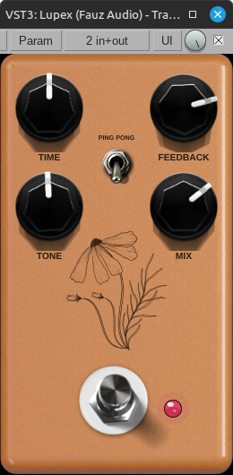

# Lupex — Analog BBD Delay



Lupex is an analog BBD-style stereo delay VST3 plugin by **Fauz Audio**, built with JUCE and CMake.  
Inspired by the character of classic analog delay pedals like the MXR Carbon Copy.

---

## Features

- BBD-style analog delay with warm, dark character
- Dual-pole low-pass filter with accumulative darkening per repeat
- Wow/Flutter modulation for organic tape-like movement
- Stereo spread with symmetric offset
- Ping-Pong mode with smooth real-time crossfade
- Bypass footswitch with LED indicator
- Adaptive time smoother — pitch shifts naturally when scrubbing delay time

## Parameters

| Parameter | Range | Description |
|---|---|---|
| Time | 1–1200ms | Delay time |
| Feedback | 0–100% | Repeat amount, supports self-oscillation |
| Tone | 0–100% | Low-pass filter cutoff (dark → bright) |
| Mix | 0–100% | Dry/wet balance |
| Ping-Pong | On/Off | Stereo ping-pong feedback mode |
| Bypass | On/Off | Hard bypass |

## Build

```bash
git clone --recursive https://github.com/maurocosentino/lupex-analog-delay
cd lupex-analog-delay
cmake -B cmake-build-release -DCMAKE_BUILD_TYPE=Release
cmake --build cmake-build-release
```

## Requirements

- JUCE 7+
- CMake 3.24+
- C++20
- Linux / Windows / macOS

## License

MIT